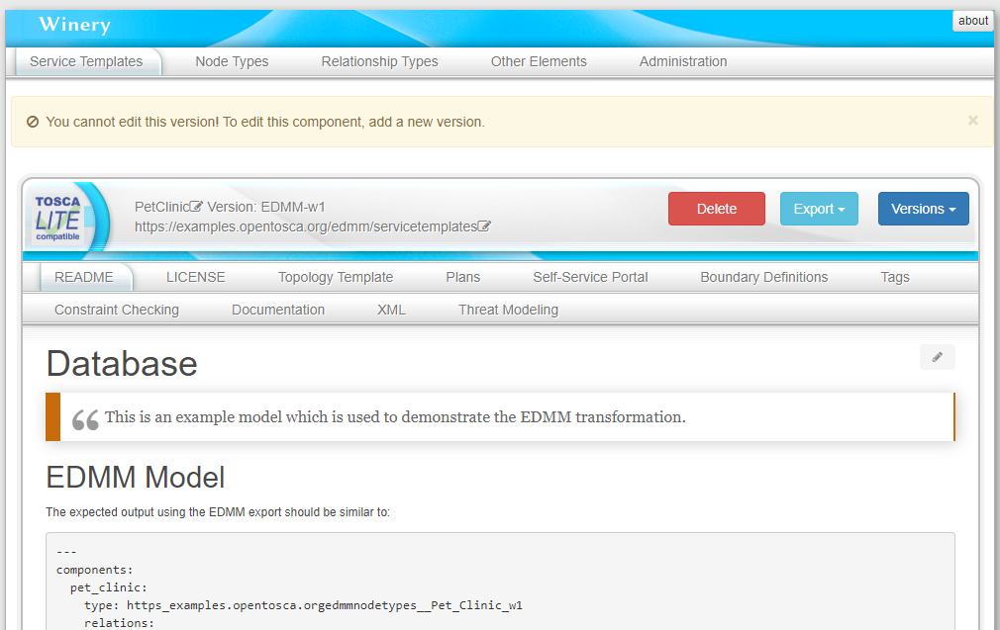
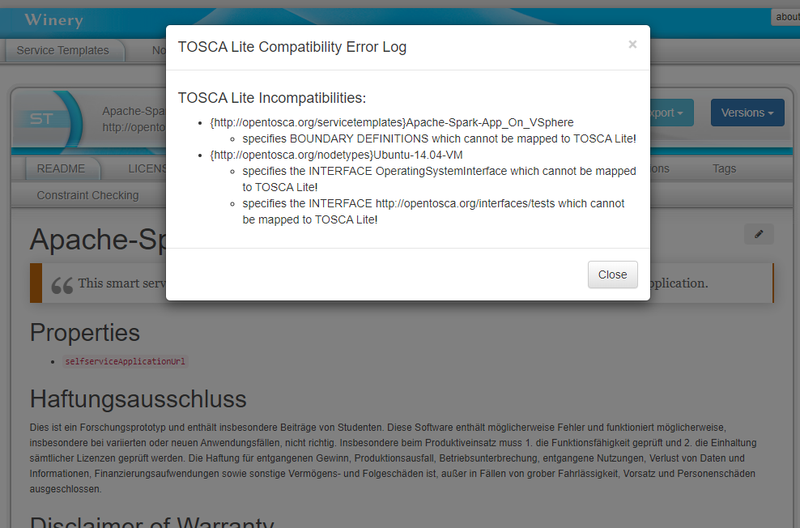

# TOSCA Light Proof of Concep based on Eclipse Winery

Winery is a Web-based environment to graphically model TOSCA topologies and plans managing these topologies.
It is an Eclipse project and thus support is available through its project page <https://eclipse.org/winery>.
Winery is also part of the OpenTOSCA ecosystem where more information is available at <http://www.opentosca.org>.

The proof of concept implemenation is based on Eclipse Winery.
The modeling tools has been extended to check existing and imported Service Templates for TOSCA Light compliancy.
The first screenshot shows the Service Template view of such a TOSCA Light compliant blueprint.
Winery will flag it to be TOSCA Light compliant by adding a special logo to the top left header.

If a Service Template does not comply with TOSCA Light, Winery has been extended to produce an "error log" as depicted in the screenshot.

**The code and the linked libraries are NOT approved by Eclipse Legal.**

**There was no security of Eclipse Winey. There might be [remote code execution vulnerabilities](https://github.com/mbechler/marshalsec). Thus, when hosting Eclipse Winery, make it accessible to turstworthy parties only.**

Both development and user documentation is rendered at <https://eclipse.github.io/winery/>.
The source for the documentation can be found at [docs/](docs).

## Running Winery

### Running via Docker

1. `docker build -t winery .`.
   In case, there are issues, you can also try `docker build --no-cache -t winery .`
2. `docker run -p 8080:8080 winery` to run Winery on <http://localhost:8080>

You can also use the pre-built image and bin it to a local repository:

    docker run -it -p 8080:8080 -v $(pwd):/var/opentosca/repository opentosca/winery

## Acknowledgements

The initial code contribution has been supported by the [Federal Ministry for Economic Affairs and Energy] as part of the [CloudCycle] project (01MD11023).
Current development is supported by the Federal Ministry for Economic Affairs and Energy as part of the projects
[SmartOrchestra] (01MD16001F) and [SePiA.Pro] (01MD16013F), as well as by the [DFG] (Deutsche Forschungsgemeinschaft) projects [SustainLife] (641730) and [ADDCompliance] (636503).
Further development is also funded by the European Union’s Horizon 2020 project [RADON].

## License

Copyright (c) 2012-2020 Contributors to the Eclipse Foundation

See the NOTICE file(s) distributed with this work for additional
information regarding copyright ownership.

This program and the accompanying materials are made available under the
terms of the Eclipse Public License 2.0 which is available at
http://www.eclipse.org/legal/epl-2.0, or the Apache Software License 2.0
which is available at https://www.apache.org/licenses/LICENSE-2.0.

SPDX-License-Identifier: EPL-2.0 OR Apache-2.0

  [CloudCycle]: http://www.cloudcycle.org/en/
  [Federal Ministry for Economic Affairs and Energy]: http://www.bmwi.de/EN/
  [Scalable JavaScript Application Architecture]: http://www.slideshare.net/nzakas/scalable-javascript-application-architecture-2012
  [SmartOrchestra]: http://smartorchestra.de/en/
  [SePiA.Pro]: http://projekt-sepiapro.de/en/
  [ADDCompliance]: http://addcompliance.cs.univie.ac.at/
  [SustainLife]: http://www.iaas.uni-stuttgart.de/forschung/projects/SustainLife
  [RADON]: http://radon-h2020.eu/
  [DFG]: http://www.dfg.de/en/
